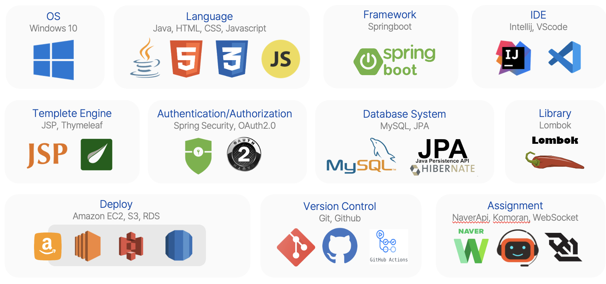

# 개인미니프로젝트
SpringBoot 게시판 미니프로젝트

## 🌸🌼🌺

### ⌛️개발기간
* 23.10.31 ~ 23.11

### 🛠️개발환경


### 🌟 텍스트 에디터 구현


<br>

> JavaScript

```javascript
const editor = document.getElementById('editor');
const btnBold = document.getElementById('btn-bold');
const btnItalic = document.getElementById('btn-italic');
const btnUnderline = document.getElementById('btn-underline');
const btnStrike = document.getElementById('btn-strike');
btnBold.addEventListener('click', function(){
    setStyle('bold');
});
btnItalic.addEventListener('click', function(){
    setStyle('italic');
});
btnUnderline.addEventListener('click', function(){
    setStyle('underline');
});
btnStrike.addEventListener('click', function(){
    setStyle('strikeThrough');
});
function setStyle(style){
    document.execCommand(style);
    focusEditor();
    checkStyle();
}
// 버튼 클릭 시 포커스를 잃기 때문에 다시 포커스를 해줌
function focusEditor(){
    editor.focus({preventScroll: true});
}
editor.addEventListener('keydown', function(){
    checkStyle();
});
editor.addEventListener('mousedown', function(){
    checkStyle();
});
function checkStyle(){
    if(isStyle('bold')){
        btnBold.classList.add('active');
    }else{
        btnBold.classList.remove('active');
    }
    if(isStyle('italic')){
        btnItalic.classList.add('active');
    }else{
        btnItalic.classList.remove('active');
    }
    if(isStyle('underline')){
        btnUnderline.classList.add('active');
    }else{
        btnUnderline.classList.remove('active');
    }
    if(isStyle('strikeThrough')){
        btnStrike.classList.add('active');
    }else{
        btnStrike.classList.remove('active');
    }
}
function isStyle(style){
    return document.queryCommandState(style);
}
```
